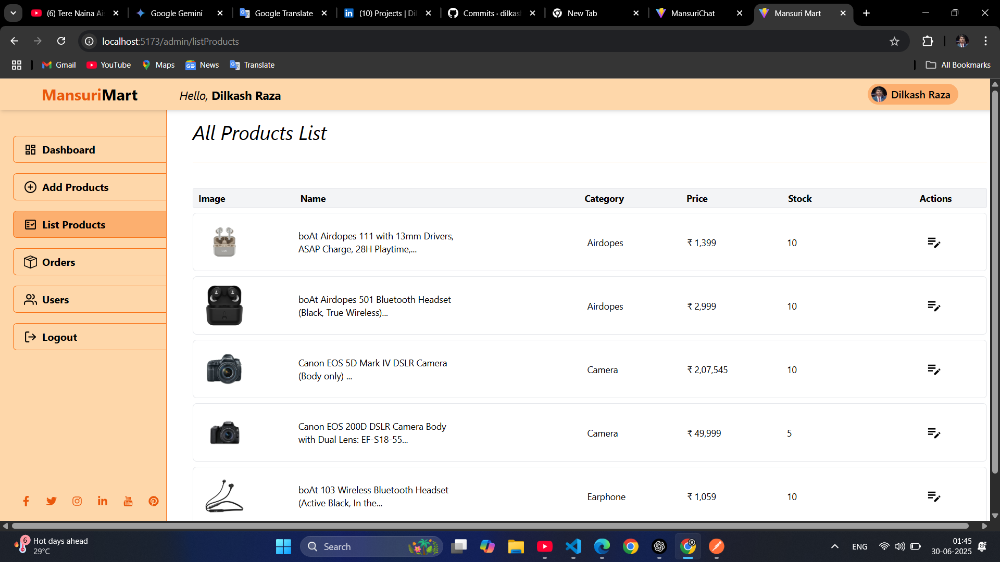
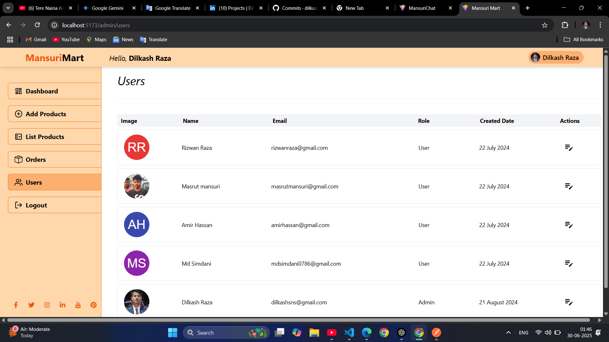

# 📸 Application Preview

<div align="center">

<p align="center">
  
  
</p>

<p align="center">
  
  
</p>

<p align="center">
  
  
</p>

<p align="center">
  
  
</p>

<p align="center">
  
  
</p>

<p align="center">
  
  
</p>

# 🛍️ MERN E-Commerce Application

A modern, full-stack E-Commerce platform built using the **MERN Stack** (MongoDB, Express.js, React.js, Node.js). The application provides a complete online shopping experience with secure authentication, product management, shopping cart, order processing, and an admin dashboard.

[](https://react.dev/)
[](https://nodejs.org/)
[](https://mongodb.com/)
[]()
[]()

</div>

---

## 📖 Overview

This project is a production-ready Full Stack E-Commerce application that enables users to browse products, search items, manage carts, place orders, and securely authenticate using JWT.

It also includes an Admin Panel where administrators can manage products, categories, users, and customer orders.

---

# ✨ Features

## 👤 User Features

- User Registration & Login
- Secure JWT Authentication
- Email Verification
- Forgot & Reset Password
- Browse Products
- Search Products
- Product Categories
- Product Details Page
- Shopping Cart
- Wishlist (Optional)
- Checkout Process
- Stripe Payment Integration
- Order History
- Responsive Design

---

## 🛠️ Admin Features

- Admin Dashboard
- Manage Products
- Manage Categories
- Manage Orders
- Manage Users
- Upload Product Images
- Update Order Status
- Sales Statistics

---

# 🚀 Tech Stack

## Frontend

- React.js
- Redux Toolkit
- React Router DOM
- Axios
- Tailwind CSS
- ShadCN UI
- React Hook Form

---

## Backend

- Node.js
- Express.js
- MongoDB
- Mongoose
- JWT Authentication
- Bcrypt
- Multer
- Cloudinary
- Nodemailer

---

## Payment

- Stripe API

---

## Tools

- Git
- GitHub
- Postman
- VS Code
- npm

---

# 📂 Project Structure

```
mern_ecommerce_app
│
├── client
│   ├── src
│   ├── public
│   └── package.json
│
├── server
│   ├── config
│   ├── controllers
│   ├── middleware
│   ├── models
│   ├── routes
│   ├── utils
│   └── package.json
│
├── README.md
└── package.json
```

---

# 🔑 Environment Variables

Create a `.env` file inside the **server** directory.

```env
PORT=5000

MONGO_URI=your_mongodb_connection_string

JWT_SECRET=your_secret

JWT_EXPIRE=7d

CLIENT_URL=http://localhost:5173

SMTP_HOST=

SMTP_PORT=

SMTP_MAIL=

SMTP_PASSWORD=

CLOUDINARY_CLOUD_NAME=

CLOUDINARY_API_KEY=

CLOUDINARY_API_SECRET=

STRIPE_SECRET_KEY=

STRIPE_PUBLISHABLE_KEY=
```

---

# ⚙️ Installation

## Clone Repository

```bash
git clone https://github.com/dilkash07/mern_ecommerce_app.git

cd mern_ecommerce_app
```

---

## Install Backend

```bash
cd server

npm install
```

---

## Install Frontend

```bash
cd client

npm install
```

---

# ▶️ Run the Project

### Backend

```bash
cd server

npm run dev
```

Backend runs on:

```
http://localhost:5000
```

---

### Frontend

```bash
cd client

npm run dev
```

Frontend runs on:

```
http://localhost:5173
```

---

# 📸 Screenshots

> Add screenshots here

```
screenshots/

├── Home.png

├── Product.png

├── Cart.png

├── Checkout.png

├── AdminDashboard.png
```

```md
# 📸 Screenshots

## 🏠 Home Page


---

## 🔍 Product Details


---

## 🗂️ Product Filtering


---

## ❤️ Wishlist


---

## 🛒 Shopping Cart


---

## 💳 Checkout


---

## 👤 User Login


---

## 👤 User Profile


---

## 📊 Admin Dashboard


---

## 📦 Product Management


---

## 👥 User Management


---

## 📋 Order Management


```

---

# 🔒 Authentication

- JWT Authentication
- Password Hashing using bcrypt
- Protected Routes
- Role Based Authorization
- Secure Cookies

---

# 💳 Payment Flow

```
Add Product

↓

Cart

↓

Checkout

↓

Stripe Payment

↓

Order Created

↓

Order History
```

---

# 📈 Future Improvements

- Product Reviews
- Product Ratings
- Coupons & Discounts
- Wishlist
- Dark Mode
- Multi-language Support
- Notifications
- Inventory Analytics
- PWA Support

---

# 🤝 Contributing

Contributions are welcome.

1. Fork the repository

2. Create your feature branch

```bash
git checkout -b feature/NewFeature
```

3. Commit changes

```bash
git commit -m "Added New Feature"
```

4. Push branch

```bash
git push origin feature/NewFeature
```

5. Open a Pull Request

---

# 👨‍💻 Author

### Dilkash Raza

Full Stack MERN Developer

GitHub

https://github.com/dilkash07

LinkedIn

(Add your LinkedIn URL)

---

# ⭐ Support

If you like this project, don't forget to ⭐ the repository.

It helps others discover the project and motivates further development.

---

## 📄 License

This project is licensed under the MIT License.

---

<div align="center">

Made with ❤️ by **Dilkash Raza**

</div>
