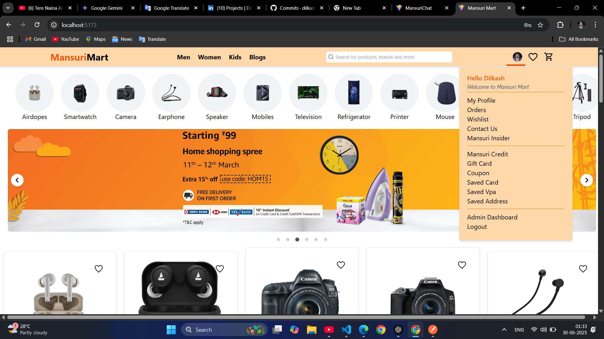
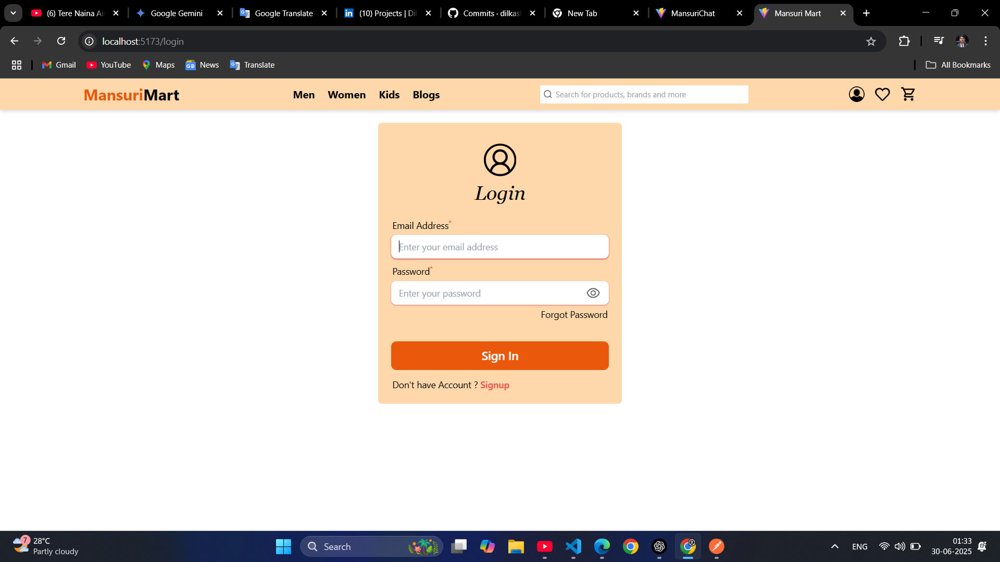
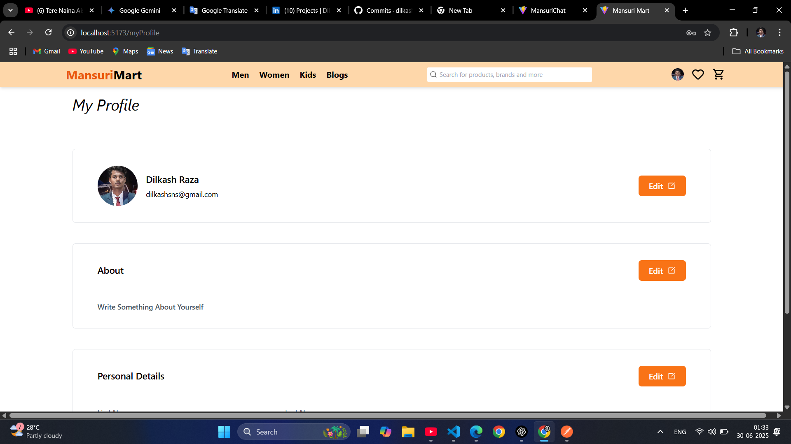
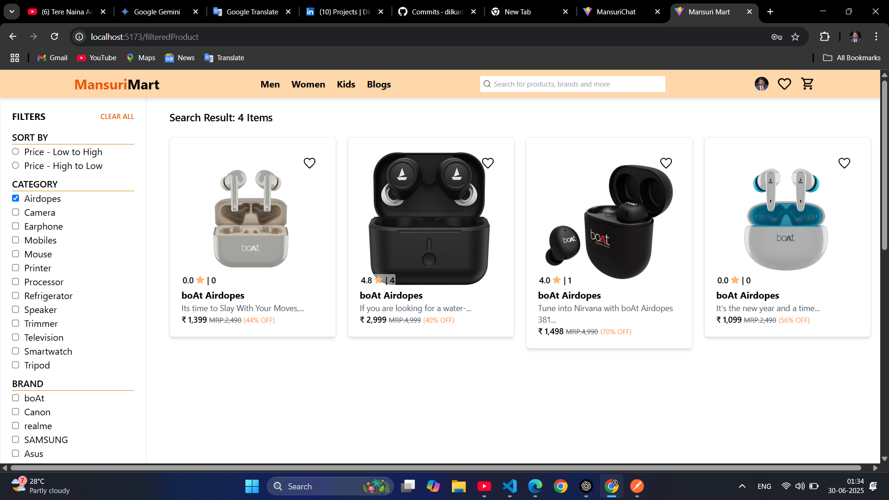
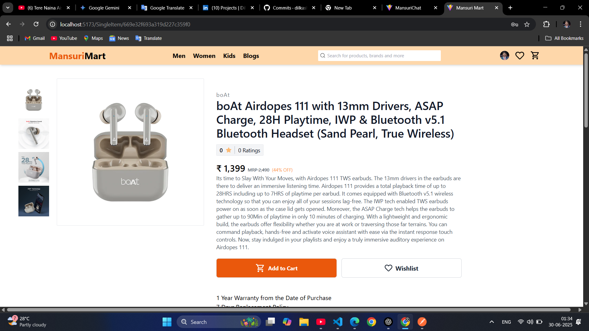
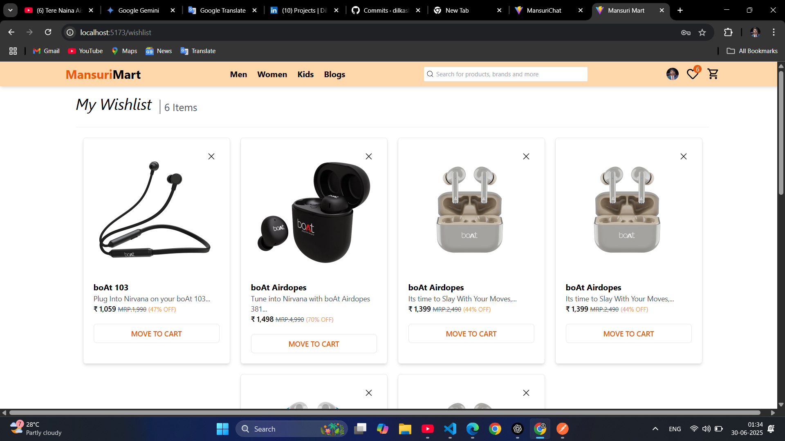
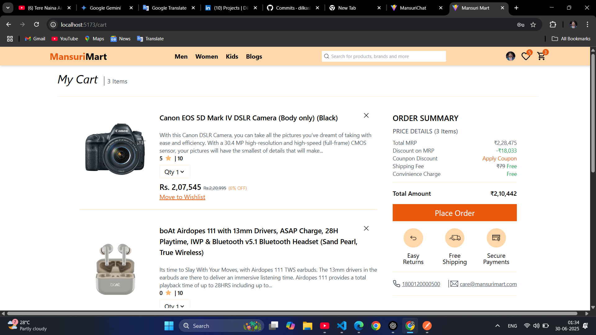
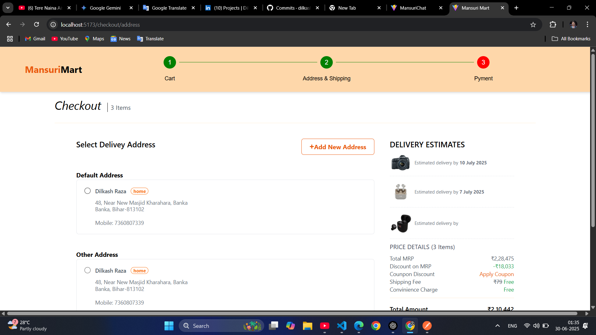
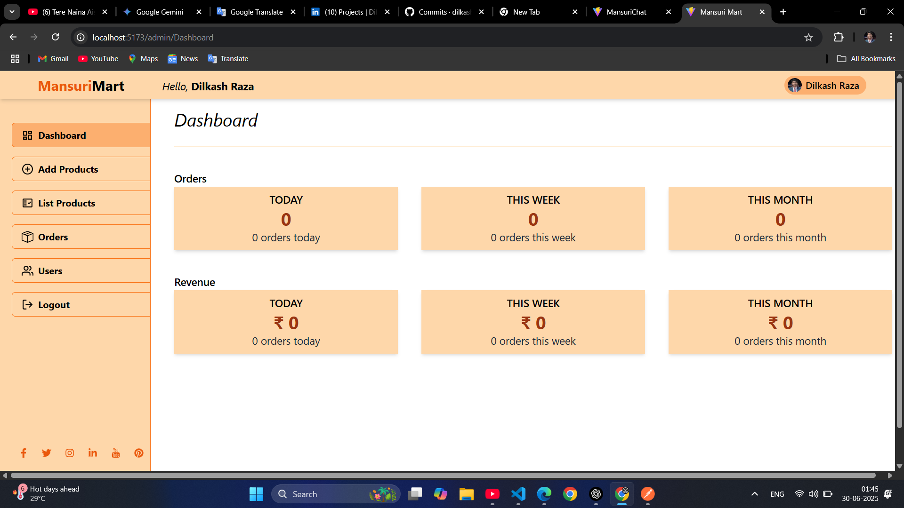
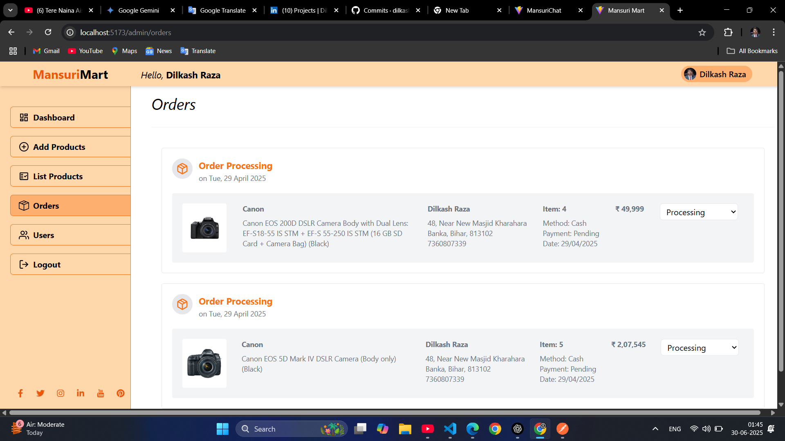

<div align="center">

# 🛍️ MERN E-Commerce Application

A modern **Full Stack E-Commerce Platform** built with the **MERN Stack (MongoDB, Express.js, React.js, Node.js)** featuring secure authentication, product management, shopping cart, wishlist, Stripe payments, order management, and a powerful admin dashboard.


</div>

---

# 📸 Application Preview

<p align="center">
  
  
</p>

<p align="center">
  
  
</p>

<p align="center">
  
  
</p>

<p align="center">
  
  
</p>

<p align="center">
  
  
</p>

<p align="center">
  
  
</p>

---

# 📖 Overview

This project is a complete Full Stack E-Commerce platform that allows users to browse products, search products, add items to their cart, manage wishlists, securely complete purchases, and track their orders.

Administrators have access to a powerful dashboard where they can manage products, categories, users, and customer orders.

---

# ✨ Features

## 👤 User Features

- User Registration & Login
- JWT Authentication
- Email Verification
- Forgot Password
- Reset Password
- Browse Products
- Search Products
- Product Categories
- Product Filtering
- Product Details
- Shopping Cart
- Wishlist
- Stripe Payment Gateway
- Secure Checkout
- Order History
- User Profile
- Responsive Design

---

## 🛠️ Admin Features

- Admin Dashboard
- Product Management
- Category Management
- User Management
- Order Management
- Upload Product Images
- Update Order Status
- Dashboard Analytics

---

# 🚀 Tech Stack

## Frontend

- React.js
- Redux Toolkit
- React Router DOM
- Axios
- Tailwind CSS
- ShadCN UI
- React Hook Form

### Backend

- Node.js
- Express.js
- MongoDB
- Mongoose
- JWT Authentication
- Bcrypt.js
- Multer
- Cloudinary
- Nodemailer

### Payment

- Stripe API

### Tools

- Git
- GitHub
- Postman
- VS Code
- npm

---

# 📂 Project Structure

```
mern_ecommerce_app
│
├── client
│   ├── src
│   ├── public
│   └── package.json
│
├── server
│   ├── config
│   ├── controllers
│   ├── middleware
│   ├── models
│   ├── routes
│   ├── utils
│   └── package.json
│
├── screenshots
├── README.md
└── package.json
```

---

# 🌐 Live Demo

### Frontend

YOUR_LIVE_DEMO_LINK

### Backend API

YOUR_BACKEND_API_LINK

---

# 🔑 Environment Variables

Create a `.env` file inside the **server** folder.

```env
PORT=5000

MONGO_URI=your_mongodb_connection_string

JWT_SECRET=your_secret_key

JWT_EXPIRE=7d

CLIENT_URL=http://localhost:5173

SMTP_HOST=

SMTP_PORT=

SMTP_MAIL=

SMTP_PASSWORD=

CLOUDINARY_CLOUD_NAME=

CLOUDINARY_API_KEY=

CLOUDINARY_API_SECRET=

STRIPE_SECRET_KEY=

STRIPE_PUBLISHABLE_KEY=
```

---

# ⚙️ Installation

## Clone Repository

```bash
git clone https://github.com/dilkash07/mern_ecommerce_app.git
```

```bash
cd mern_ecommerce_app
```

## Install Backend

```bash
cd server
npm install
```

## Install Frontend

```bash
cd ../client
npm install
```

---

# ▶️ Run Locally

### Backend

```bash
cd server
npm run dev
```

Runs on:

```
http://localhost:5000
```

### Frontend

```bash
cd client
npm run dev
```

Runs on:

```
http://localhost:5173
```

---

# 🔒 Authentication & Security

- JWT Authentication
- Password Hashing with Bcrypt
- Protected Routes
- Role-Based Authorization
- Secure Password Reset
- Email Verification
- Secure Cookies

---

# 💳 Payment Flow

```
Browse Products
       │
       ▼
Add to Cart
       │
       ▼
Checkout
       │
       ▼
Stripe Payment
       │
       ▼
Order Created
       │
       ▼
Order History
```

---

# 📈 Future Enhancements

- Product Reviews & Ratings
- Coupon System
- Multiple Payment Gateways
- Product Recommendations
- Inventory Analytics
- Dark Mode
- Push Notifications
- Multi-language Support
- Progressive Web App (PWA)

---

# 🤝 Contributing

Contributions are welcome.

1. Fork the repository

2. Create a new branch

```bash
git checkout -b feature/new-feature
```

3. Commit your changes

```bash
git commit -m "Add new feature"
```

4. Push your branch

```bash
git push origin feature/new-feature
```

5. Open a Pull Request

---

# 👨‍💻 Author

## Dilkash Raza

Full Stack MERN Developer

**GitHub**

https://github.com/dilkash07

**LinkedIn**

https://www.linkedin.com/in/dilkash-raza-2185ab261/

---

# ⭐ Show Your Support

If you found this project helpful, please consider giving it a ⭐ on GitHub.

It motivates me to build more open-source projects.

---

# 📄 License

This project is licensed under the **MIT License**.

---

<div align="center">

### ❤️ Made with React, Node.js, MongoDB & Express

**Developed by Dilkash Raza**

⭐ Star this repository if you like it!

</div>
